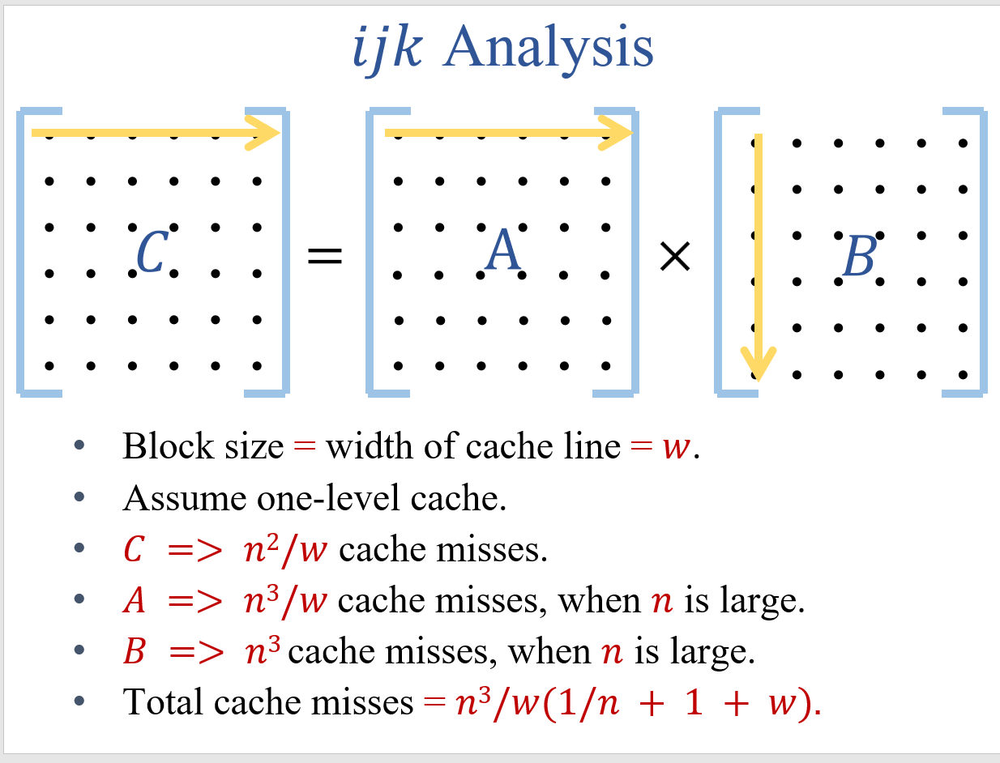
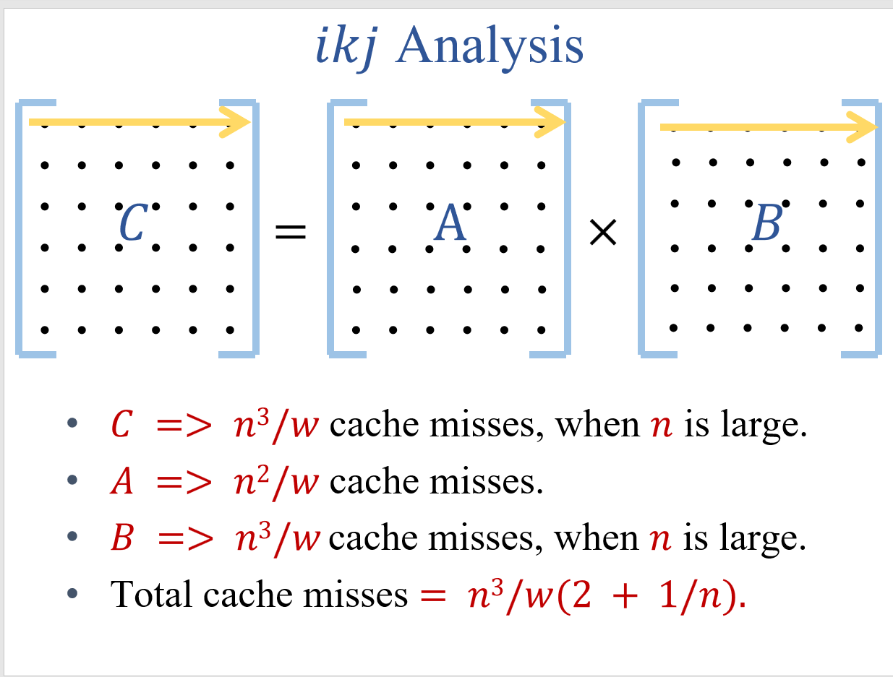

# Cache-Miss-Simulation-For-Matrix-Multiplication
This project is a cache's miss's simulation for matrix multiplication.
# 东南大学 数据结构与算法实践 Project 1
## 项目结构
* header 存放着所有的.hpp文件
* source 存放着所有的.cpp文件

## 代码简介
* 所有的.hpp都是对应.cpp的头文件 声明在.hpp中 定义在.cpp中
* ReadMatrix.cpp 包含获取文件中矩阵规模的函数以及读取矩阵的函数（disk->main memory）
* MatrixElement.cpp 是最终存放在Cache中矩阵元素的数据结构
 其实 是一个四元组 ("来自于哪个矩阵","行坐标"，"列坐标","值")
* Cache.cpp 包含了采用LRU算法 Cache的定义以及相关函数的定义
* FinalTest.cpp 最终测试的文件 含有 ijk 和 ikj 两种order的矩阵相乘的测试

## 使用说明
* 因为这个实验的重心是在于对Cache Miss的模拟，因此这里代码实现的是方阵的乘法（别用成矩阵（你想用自己改））
* 首先运行 matrix_producer脚本 随机生成你想要规模的方阵 数据范围在 0-100 可以根据需求自己调节
* 然后你就可以直接运行FinalTest.cpp 开始测试了）（输入Cache的行宽 以及 行数）

## 附加说明
* 最终输出的理论miss值 是来自于SEU的ppt里的计算方法 这里贴两张图

这里的计算是行数为1的 Cache 并且 每次读取一整行Cache的数据（以后就不用查询了）
实验中的读取大小为一个单元 而不是一整行 所以实际missNum 与 理论missNum 相差较大

***Good Luck***
  

